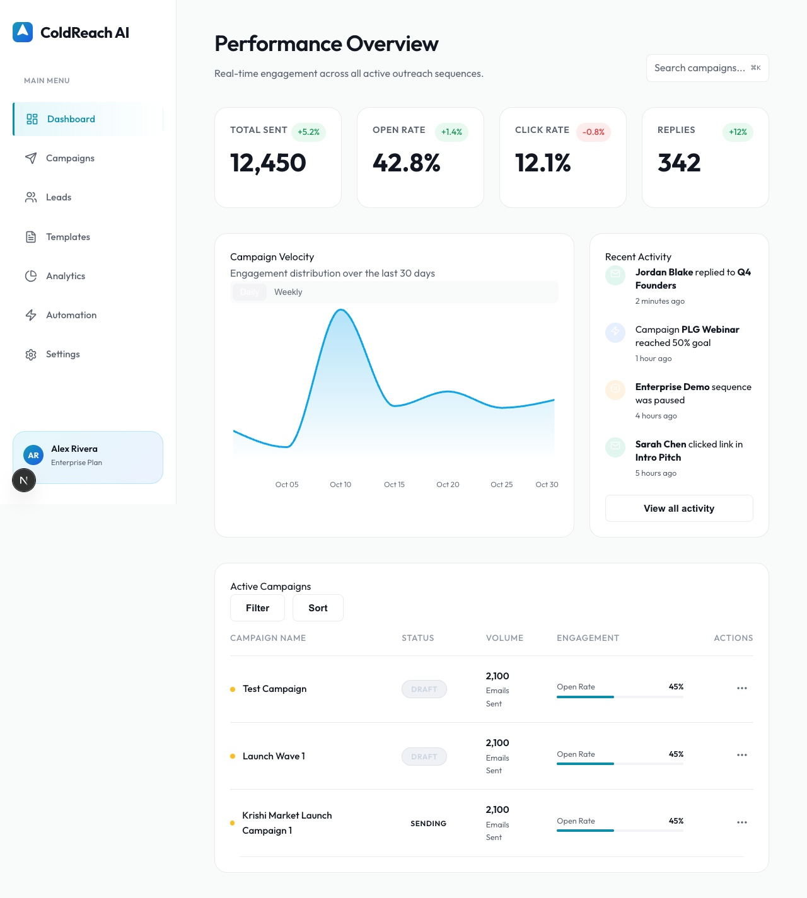
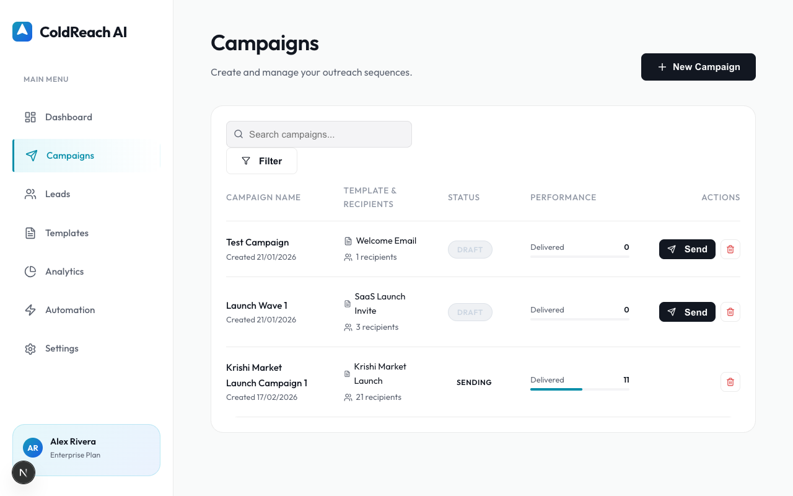
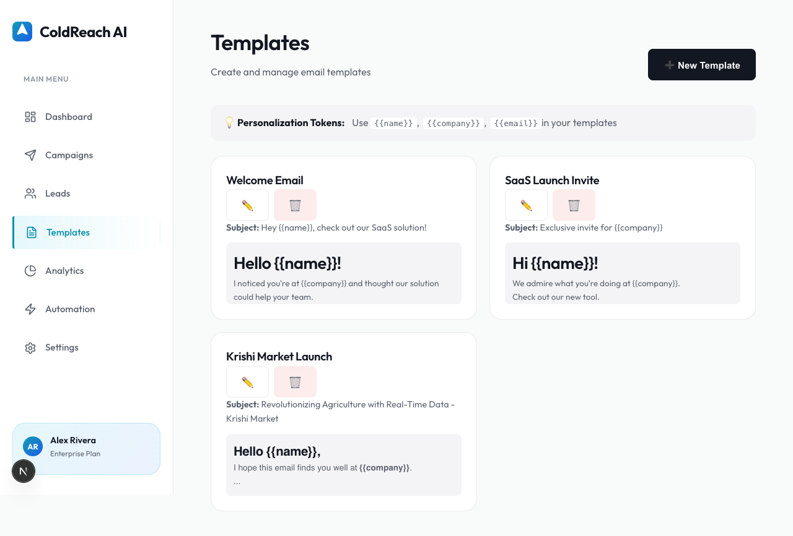
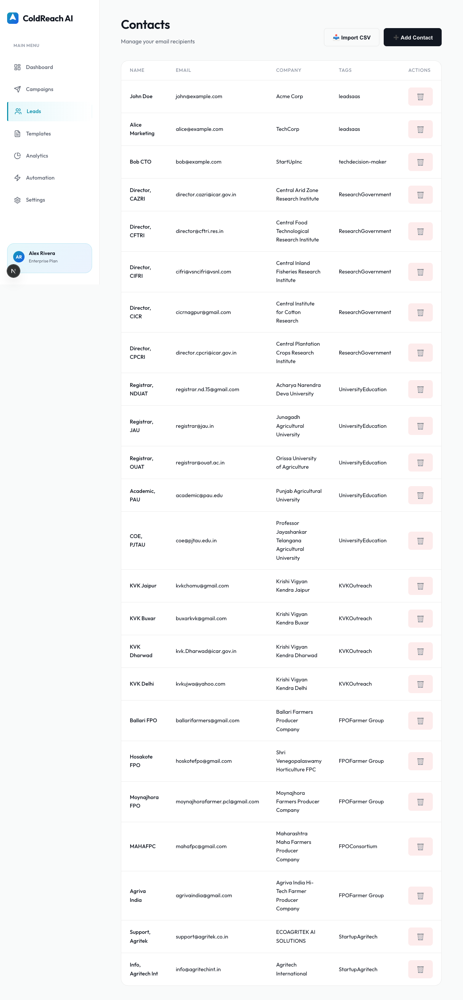

# Marketing Emailer

A powerful, self-hosted email marketing application built with Next.js. Create campaigns, manage contacts, and send personalized emails using your own SMTP provider (Zoho, Brevo, Gmail, etc.).



## Features

*   **Campaign Management**: Create, edit, and track email campaigns.
*   **Contact Management**: Organize contacts with tages and details.
*   **Template Engine**: Design HTML emails with personalization variables (e.g., `{{name}}`, `{{company}}`).
*   **Flexible Sending**: Support for immediate bulk sending or graduate scheduling to avoid rate limits.
*   **SMTP Support**: Works with any SMTP provider via Nodemailer.
*   **Local Database**: efficient JSON-file based persistence (no external DB required).

## App Flow

1.  **Manage Contacts**: Add contacts manually or import them via seed scripts.
2.  **Create Templates**: Design your email content. Use `{{variable}}` syntax for personalization.
3.  **Launch Campaign**:
    *   Create a new campaign.
    *   Select a template and target contacts.
    *   Click **Send** for immediate delivery.
4.  **Smart Scheduling** (Optional):
    *   Use `node scripts/send_gradually.js` to send large campaigns slowly, avoiding spam filters and rate limits.

## Screenshots

### Campaigns
Manage your ongoing and past campaigns.


### Templates
Create reusable email designs.


### Contacts
Manage your subscriber base.


## Technical Implementation

This project is a modern full-stack application:

*   **Framework**: [Next.js 14](https://nextjs.org/) (App Router).
*   **Styling**: Tailwind CSS for a clean, responsive UI.
*   **Storage**: Low-latency JSON file-based database (custom implementation in `lib/db.ts`).
*   **Email Engine**: [Nodemailer](https://nodemailer.com/) for universal SMTP support.
*   **Background Jobs**: Custom Node.js scripts for long-running processes like gradual sending.

### Key Components

*   `app/api/send/route.ts`: Handles the immediate sending logic.
*   `scripts/send_gradually.js`: A standalone script that resumes campaigns and sends with randomized delays (e.g., 45-75s) to mimic human behavior.
*   `lib/email.ts`: Centralized email utility wrapping Nodemailer.

## Getting Started

1.  **Clone the repo**:
    ```bash
    git clone https://github.com/sanjibani/marketing_emailer.git
    cd marketing_emailer
    ```

2.  **Install dependencies**:
    ```bash
    npm install
    ```

3.  **Configure Environment**:
    Rename `.env.example` to `.env` and add your SMTP credentials:
    ```ini
    SMTP_HOST=smtp.yourprovider.com
    SMTP_PORT=587
    SMTP_USER=you@example.com
    SMTP_PASS=your_password
    FROM_EMAIL="Your Name <you@example.com>"
    ```

4.  **Run the App**:
    ```bash
    npm run dev
    ```
    Open [http://localhost:3000](http://localhost:3000).
